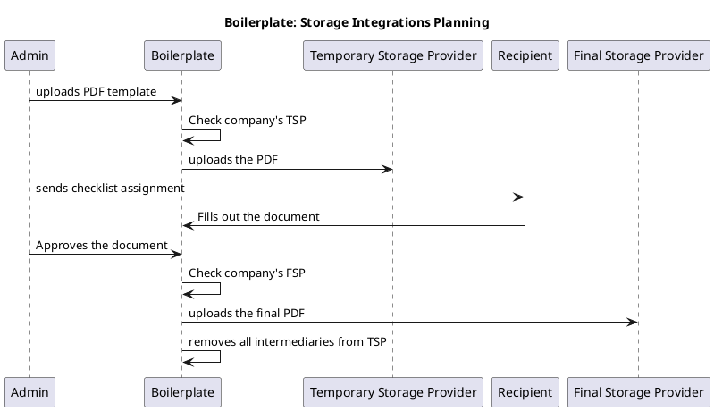

# Project: Storage Integrations

**Core Goal**: Ability for Boilerplate to integrate with various storage providers to hand-off files when they are deemed "completed". This, in turn, reduces our risk liability by simply not having the files on our systems.

**Last Changed**: 01/31/2023 by @lev.

## Overview / User Stories

- Allow the user to add integrations -> for now, let's ask them to email us.
- Files should be uploaded to their storage provider once a document is complete.

## New (or changed) Models

```elixir
schema "storage_provider" do
    field :backend, :string, default: "s3" # One of "egnyte", "googledrive", "s3".
    field :meta_data, :map, default: %{} # Metadata for the integration, API keys, locations, etc.
    field :status, :integer, default: 0
    field :flags, :integer, default: 0
end


schema "companies" do
  # ...

  # Temporary Storage Provider (TSP): A storage provider for temporary storage of data
  field :temporary_storage_provider, references(:storage_provider, on_delete: :nothing)

  # Final Storage Provider (FSP): The final destionation for all documents
  field :final_storage_provider, references(:storage_provider, on_delete: :nothing)

  # ...
end
```

## Backend Work Description

- Add the `BoilerPlate.StorageProvider` model.
- Modify the `BoilerPlate.Company` model.
- Go through all `Arc.store/3` callsites and move them to use `StorageBehaviour.put_file/2`.`
  - This is new function, it should store the file according to the Behaviour's intent.
- Remove our dependency on `arc`.
- Instead of `Application.compile_env/2` to get the `@storage_mod`, write a helper function in `lib/boilerplate_web.ex` that can figure out the correct `StorageBehaviour` based on the DB.
  - Better would be to write this function in a "helper" module and import it in the `:controller` section of the `boilerplate_web.ex` file. This way, all controllers will inherit this function automatically.
  - The function should default to `StorageAwsImpl`.
  - The final storage providers can be cached into ETS for minimal performance loss.
- When a document/request/etc is approved - the final copy should be uploaded to FSP and all intermediaries removed from the TSP.

**At this point, the software should be working fine.**

- Write tests where a provider uses `StorageLocalImpl`, add `meta_data` such that it will write files to a folder that's different from `uploads` (the default).
- Write the Egnyte integration. :-)

## Proposed Flow



## Open Questions

- What do we do when storage providers are changed?
  - @lev: Don't let them do this.
